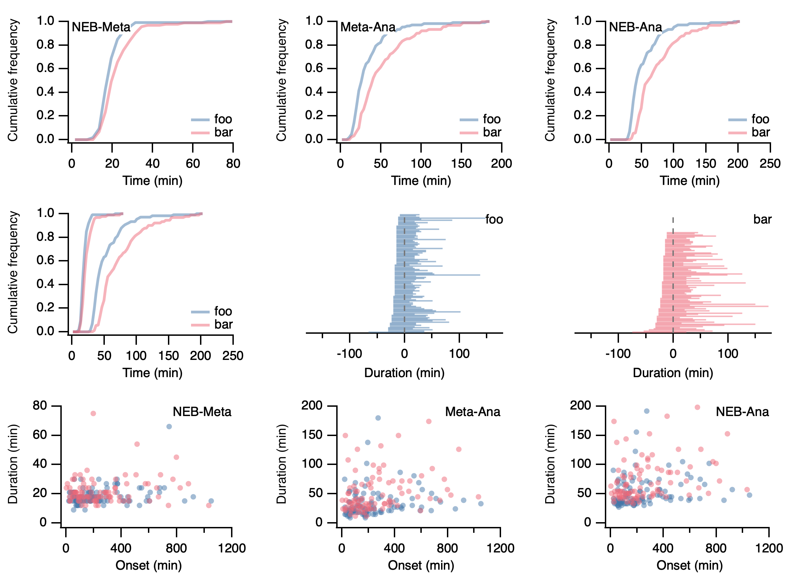

# MitoticTiming

Visualising mitotic timing and progression of mitosis in IGOR Pro

Summary statistics inculding cumulative histograms and stick graphs are plotted from data acquired by the user.

## Workflow

User gathers data in an Excel workbook.
Each worksheet is a separate condition (label it appropriately)
Three columns labelled NEB, Meta, Ana
Each row is a cell's timeline, user inputs the frame numbers for transitions.

Select _Macros > Miotic Timing..._ in Igor after loading `MitoticTiming.ipf`

Using this panel, the user specifies the Excel workbook by clicking _File_.

- The time interval of the experiments can be specified (default is 3 min, if your data is in minutes and not frame numbers, specify 1 here).
- Uncheck the box to remove the cells that do not divide from summary statistics.
- The stick graph can be ordered according to the duration of three different intervals depending on user preference.

